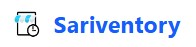
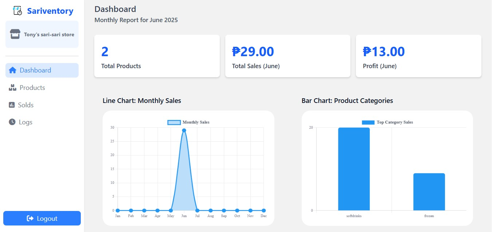
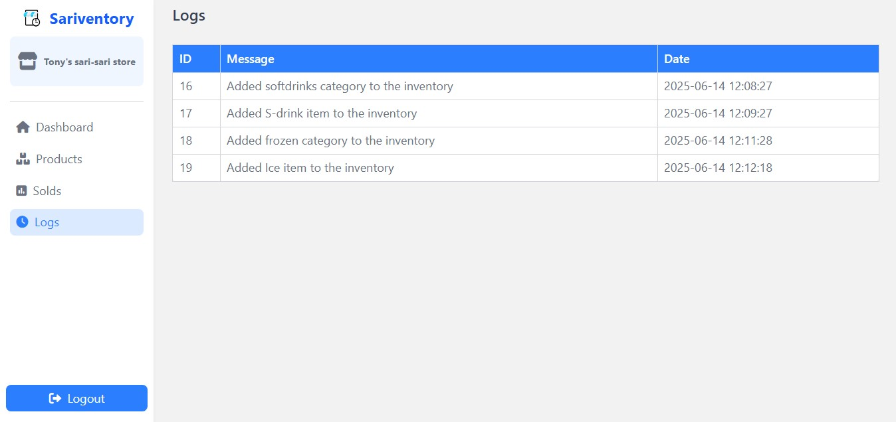

# Sariventory

<p align="center">
  
</p>

<p align="center">
  <b>Sariventory</b> is a modern inventory and sales management system built for sari-sari stores and small businesses.  
  Easily track products, manage categories, monitor sales, and gain insights into your store's performance—all in one place.
</p>

---

## 🚀 Features

- **Product & Category Management**: Add, update, and delete products and categories with ease.
- **Stock Tracking**: Monitor inventory and update stock in real time.
- **Sales Recording**: Record sold items and automatically update inventory.
- **Profit & Sales Analytics**: Visualize sales and profit trends with dynamic charts.
- **Activity Logs**: Keep track of all inventory actions for transparency.
- **Authentication**: Secure login and registration for store owners.

---

## 🖥️ Screenshots

<p align="center">
  <i>Dashboard</i><br>
  
</p>

<p align="center">
  <i>Product</i><br>
  
</p>

<p align="center">
  <i>Solds</i><br>
  
</p>

<p align="center">
  <i>Logs</i><br>
  
</p>

---

## ⚙️ Tech Stack

- **Backend:** Laravel 12
- **Frontend:** Blade, Tailwind CSS, SweetAlert2, Chart.js
- **Database:** MySQL (or compatible)
- **Build Tools:** Vite, Laravel Mix

---

## 📦 Installation

1. **Clone the repository**
    ```sh
    git clone https://github.com/yourusername/sariventory.git
    cd sariventory
    ```

2. **Install dependencies**
    ```sh
    composer install
    npm install
    ```

3. **Copy and configure environment**
    ```sh
    cp .env.example .env
    ```
    - Set your database credentials and other environment variables in [.env](http://_vscodecontentref_/0).

4. **Generate application key**
    ```sh
    php artisan key:generate
    ```

5. **Run migrations**
    ```sh
    php artisan migrate
    ```

6. **Build frontend assets**
    ```sh
    npm run dev
    ```
    or for production:
    ```sh
    npm run build
    ```

7. **Start the development server**
    ```sh
    php artisan serve
    ```
---

## 📝 Usage

- Register a new account or log in.
- Add categories and products to your inventory.
- Update stock levels and record sales.
- View analytics and logs to monitor your store's performance.

---


## 📄 License

This project is open-sourced under the [MIT license](https://opensource.org/licenses/MIT).

---

## 🙏 Credits

- [Laravel](https://laravel.com/)
- [Tailwind CSS](https://tailwindcss.com/)
- [SweetAlert2](https://sweetalert2.github.io/)
- [Chart.js](https://www.chartjs.org/)

---

<p align="center">
  <b>Sariventory</b> &mdash; Manage your sari-sari store smarter, not harder!
</p>
